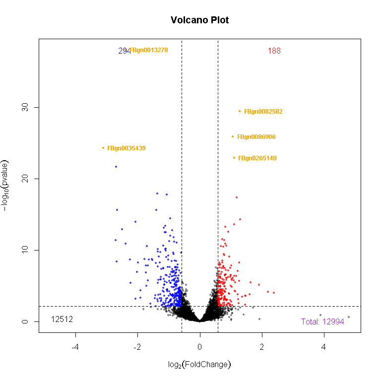
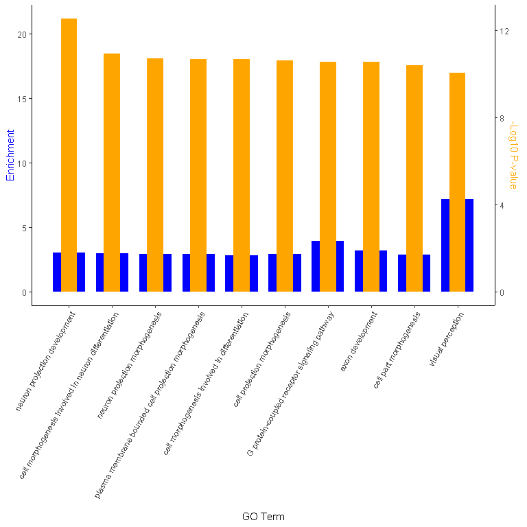

BinfTools - QuickStart Guide
============================

Installation
============

    #install.packages("devtools")
    #devtools::install_github("kevincjnixon/BinfTools")
    library(BinfTools)

Usage
=====

Ideally, we will be using objects created from DESeq2, but objects from
other RNA-seq analysis packages can be modified to work as input for
BinfTools. Here, we are using RNA-seq data from Nixon et al. (2019)
comparing gene expression in the *Drosophila* musrhoom body between
Wild-Type (expressing mCherry-shRNA) and Bap60 knockdown.

    ###Load data generated from DESeq2:
    head(norm_counts) #Normalized gene counts (from counts(dds, normalized=T))
    #>                   mC_1        mC_2        mC_3       B60_1      B60_2
    #> FBgn0000008 14919.5007 23183.73590 19569.22815 11179.14132 14068.5861
    #> FBgn0000014   529.3257    27.68207   345.23983   644.51695   950.8071
    #> FBgn0000015  1001.9762    55.36415   317.38186   504.13726   659.7274
    #> FBgn0000017 19763.6333 23887.49936 24366.76835 21539.57193 21727.0212
    #> FBgn0000018   153.9857    95.82256    17.90869    94.26957   135.9438
    #> FBgn0000024 33611.6504 33993.58529 33080.34302 36574.54357 28803.2969
    head(res) #Results object (from as.data.frame(results(dds, contrast=c("Condition","WT","KO"))))
    #>                baseMean log2FoldChange     lfcSE       stat      pvalue
    #> FBgn0000008 16584.03843    -0.60670534 0.1994743 -3.0415214 0.002353858
    #> FBgn0000014   499.51433     1.40727447 0.8798824  1.5993893 0.109734130
    #> FBgn0000015   507.71737     0.34488755 0.8811641  0.3913999 0.695501674
    #> FBgn0000017 22256.89883    -0.06770743 0.1336063 -0.5067683 0.612317420
    #> FBgn0000018    99.58606     0.36807679 1.0780470  0.3414293 0.732780444
    #> FBgn0000024 33212.68383    -0.03807819 0.1322525 -0.2879205 0.773407632
    #>                   padj
    #> FBgn0000008 0.02004494
    #> FBgn0000014 0.31988301
    #> FBgn0000015 0.86736891
    #> FBgn0000017 0.82154833
    #> FBgn0000018         NA
    #> FBgn0000024 0.90830459
    print(cond) #Character vector of conditions (from as.character(dds$Condition))
    #> [1] "WT" "WT" "WT" "KO" "KO"
    print(geneSet) #List of gene sets related to rhodopsin signaling imported from qusage::read.gmt("rhodopsin.gmt")
    #> $deactivation_of_rhodopsin_mediated_signaling
    #>  [1] "FBgn0004784" "FBgn0003218" "FBgn0287478" "FBgn0000253" "FBgn0000120"
    #>  [6] "FBgn0086704" "FBgn0004623" "FBgn0261549" "FBgn0030555" "FBgn0004435"
    #> [11] "FBgn0262738" "FBgn0015721" "FBgn0002938" "FBgn0000121" "FBgn0265959"
    #> [16] "FBgn0001263" "FBgn0260798"
    #> 
    #> $regulation_of_rhodopsin_mediated_signaling_pathway
    #>  [1] "FBgn0004784" "FBgn0003218" "FBgn0287478" "FBgn0000253" "FBgn0000120"
    #>  [6] "FBgn0086704" "FBgn0027794" "FBgn0004623" "FBgn0261549" "FBgn0030555"
    #> [11] "FBgn0004435" "FBgn0262738" "FBgn0015721" "FBgn0002938" "FBgn0000121"
    #> [16] "FBgn0265959" "FBgn0001263" "FBgn0260798"
    #> 
    #> $rhodopsin_mediated_signaling_pathway
    #>  [1] "FBgn0004784" "FBgn0003218" "FBgn0003861" "FBgn0287478" "FBgn0000253"
    #>  [6] "FBgn0000120" "FBgn0010350" "FBgn0086704" "FBgn0027794" "FBgn0004623"
    #> [11] "FBgn0036260" "FBgn0261549" "FBgn0030555" "FBgn0004435" "FBgn0262738"
    #> [16] "FBgn0015721" "FBgn0002938" "FBgn0000121" "FBgn0265959" "FBgn0013972"
    #> [21] "FBgn0002940" "FBgn0001263" "FBgn0260798"

Available Functions
-------------------

### Converting results from Limma or EdgeR

If you prefer to use Limma or EdgeR for analysis, the functions
*fromLimma()* or *fromEdgeR()* will convert the output of Limma’s
*topTable()* function or EdgeR’s *topTags()* function to data frames
compatible with BinfTools functions.

    ### Converting Limma results:
    #res<-limma::topTable(fit, number=Inf)
    #res<-fromLimma(res)
    ###Converting EdgeR results:
    #res<-edgeR::topTags(de, n=Inf)
    #res<-fromEdgeR(res)

### GenerateGSEA

This function will generate a ranked list of genes from the *res* object
to run a PreRanked gene set enrichment analysis GSEA (Subramanian et al.
2005) See *?GenerateGSEA* to view all options

    GenerateGSEA(res, filename="GSEA.rnk", bystat=T, byFC=F)

### MA\_Plot()

This function is similar to the *plotMA()* function from DESeq2 (Love,
Huber, and Anders 2014), however it is more customizable. See
*?MA\_Plot* to view all options

    #Pull top significant genes to label and colour
    genes<-rownames(res[order(res$padj),])[1:5]
    #Make an MA plot
    MA_Plot(res, title="MA Plot", p=0.05, FC=log(1.5,2), lab=genes, col=genes)

MA Plot

    #> $Down
    #> [1] 294
    #> 
    #> $Up
    #> [1] 188
    #> 
    #> $No_Change
    #> [1] 12512

### volcanoPlot()

This function will generate a volcano plot from the *res* object. See
*?volcanoPlot* to view all options

    volcanoPlot(res, title="Volcano Plot", p=0.05, FC=log(1.5,2), lab=genes, col=genes)

Volcano Plot diplaying upregulated (red) and downregulated (blue) genes

    #> $Down
    #> [1] 294
    #> 
    #> $Up
    #> [1] 188
    #> 
    #> $No_Change
    #> [1] 12512

### GO\_GEM()

This function will run a gene ontology analysis using gprofiler2’s
*gost()* function (Kolberg and Raudvere 2020) and output the results in
a table (.txt), a .gem file (for compatibility with Cytoscape’s
EnrichmentMap app (Merico et al. 2010; Reimand et al. 2019)), and two
figures in a single .pdf displaying the top 10 enriched and top 10
significant terms. See *?GO\_GEM* to view all options

    #Get downregulated gene names
    genes<-rownames(subset(res, padj<0.05 & log2FoldChange < log(1.5, 2)))
    #create output directory
    dir.create("GO")
    #Run GO analysis for Biological Process and output to folder "GO/GO_analysis*"
    GO_GEM(genes, species="dmelanogaster", bg=rownames(res), source="GO:BP", prefix="GO/GO_analysis")
    #> Detected custom background input, domain scope is set to 'custom'

Top 10 Enriched GO terms - minimum 10 genes/term

Top 10 Significant GO terms - maximum 500 genes/term

### zheat()

This function will generate a heatmap of z-score normalized gene counts
using pheatmap (Kolde 2019). See *?zheat* to view all options

    #Get the names of all differentially expressed genes
    DEGs<-rownames(subset(res, padj<0.05 & abs(log2FoldChange)>log(1.5,2)))
    #Pull top significant genes to label and colour
    top_genes<-rownames(res[order(res$padj),])[1:5]
    #Generate a heatmap
    zheat(genes=DEGs, counts=norm_counts, conditions=cond, con="WT", title="DEGs", labgenes = top_genes)
    #> [1] "scaling to all genes..."
    #> [1] "pulling certain genes..."
    #> [1] "KO" "WT"
    #> [1] "WT" "KO"
    #> [1] 1.740516

Heatmap of DEGs

### count\_plot()

This function Will generate a violin plot of normalized gene expression
for a specified group of genes. See *?count\_plot* to view all options.

    #Check genes related to rhodopsin signaling from rhodopsin geneSet
    genes<-unique(unlist(geneSet))
    #Compare gene expression between the two conditions using z-score normalized counts:
    count_plot(counts=norm_counts, scaling="zscore", genes=genes, condition=cond, title="Rhodopsin Genes", compare=list(c("WT","KO")))

Violin plot comparing gene expression of rhodopsin genes genes between
conditions

### gsva\_plot()

This function will run a single sample gene set enrichment analysis
(ssGSEA) using the GSVA package (Hänzelmann, Castelo, and Guinney 2013)
and generate a violin plot of normalized enrichment scores using custom
gene sets. This is especially useful after running a GSEA using the rnk
file generated using *GenerateGSEA()* and finding a cluster of related
pathways in the EnrichmentMap (see Reimand et al. 2019). See
*?gsva\_plot* to view all options.

    #Import the gene sets associated with pathways of an enrichment map cluster - In this case rhodopsin signaling
    #library(qusage)
    #geneSet<-read.gmt("rhodopsin.gmt")

    #Now run the gsva using z-score normalized gene expression and make a plot:
    gsva_plot(counts=t(scale(t(norm_counts))), geneset=geneSet, method="ssgsea", condition=cond, title="Rhodopsin-Mediated Signaling", compare=list(c("WT","KO")))
    #> Estimating ssGSEA scores for 3 gene sets.
    #>   |                                                                              |                                                                      |   0%  |                                                                              |==============                                                        |  20%  |                                                                              |============================                                          |  40%  |                                                                              |==========================================                            |  60%  |                                                                              |========================================================              |  80%  |                                                                              |======================================================================| 100%

Violin plot comparing normalized enrichment scores of pathways involved
in rhodopsin signaling between conditions

Other Dependencies Not Mentioned:
---------------------------------

-   ggplot2 (Wickham 2016)
-   ggpubr (Kassambara 2020a)
-   rstatix (Kassambara 2020b)
-   tidyr (Wickham 2020)
-   dplyr (Wickham et al. 2020)

References
==========

Hänzelmann, Sonja, Robert Castelo, and Justin Guinney. 2013. “GSVA: Gene
Set Variation Analysis for Microarray and RNA-Seq Data.” *BMC
Bioinformatics* 14: 7. <https://doi.org/10.1186/1471-2105-14-7>.

Kassambara, Alboukadel. 2020a. *Ggpubr: ’Ggplot2’ Based Publication
Ready Plots*. <https://CRAN.R-project.org/package=ggpubr>.

———. 2020b. *Rstatix: Pipe-Friendly Framework for Basic Statistical
Tests*. <https://CRAN.R-project.org/package=rstatix>.

Kolberg, Liis, and Uku Raudvere. 2020. *Gprofiler2: Interface to the
’G:Profiler’ Toolset*. <https://CRAN.R-project.org/package=gprofiler2>.

Kolde, Raivo. 2019. *Pheatmap: Pretty Heatmaps*.
<https://CRAN.R-project.org/package=pheatmap>.

Love, Michael I., Wolfgang Huber, and Simon Anders. 2014. “Moderated
Estimation of Fold Change and Dispersion for Rna-Seq Data with Deseq2.”
*Genome Biology* 15 (12): 550.
<https://doi.org/10.1186/s13059-014-0550-8>.

Merico, Daniele, Ruth Isserlin, Oliver Stueker, Andrew Emili, and Gary
D. Bader. 2010. “Enrichment Map: A Network-Based Method for Gene-Set
Enrichment Visualization and Interpretation.” *PLoS One* 5 (11): e13984.
<https://doi.org/10.1371/journal.pone.0013984>.

Nixon, Kevin C. J., Justine Rousseau, Max H. Stone, Mohammed Sarikahya,
Sophie Ehresmann, Seiji Mizuno, Naomichi Matsumoto, et al. 2019. “A
Syndromic Neurodevelopmental Disorder Caused by Mutations in Smarcd1, a
Core Swi/Snf Subunit Needed for Context-Dependent Neuronal Gene
Regulation in Flies.” *American Journal of Human Genetics* 104 (4):
596–610. <https://doi.org/10.1016/j.ajhg.2019.02.001>.

Reimand, Jüri, Ruth Isserlin, Veronique Voisin, Mike Kucera, Christian
Tannus-Lopes, Asha Rostamianfar, Lina Wadi, et al. 2019. “Pathway
Enrichment Analysis and Visualization of Omics Data Using G:Profiler,
Gsea, Cytoscape and Enrichmentmap.” *Nature Protocols* 14 (2): 482–517.
<https://doi.org/10.1038/s41596-018-0103-9>.

Subramanian, Aravind, Pablo Tamayo, Vamsi K. Mootha, Sayan Mukherjee,
Benjamin L. Ebert, Michael A. Gillette, Amanda Paulovich, et al. 2005.
“Gene Set Enrichment Analysis: A Knowkledge-Based Approach for
Interpreting Genome-Wide Expression Profiles.” *PNAS* 102 (43):
15545–50. <https://doi.org/10.1073/pnas.0506580102>.

Wickham, Hadley. 2016. *Ggplot2: Elegant Graphics for Data Analysis*.
Springer-Verlag New York. <https://ggplot2.tidyverse.org>.

———. 2020. *Tidyr: Tidy Messy Data*.
<https://CRAN.R-project.org/package=tidyr>.

Wickham, Hadley, Romain François, Lionel Henry, and Kirill Müller. 2020.
*Dplyr: A Grammar of Data Manipulation*.
<https://CRAN.R-project.org/package=dplyr>.
